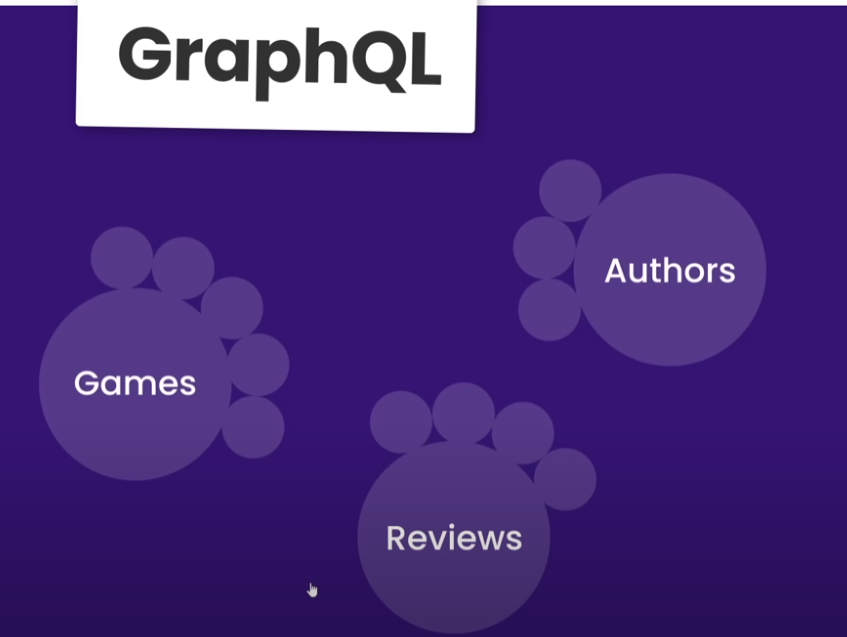
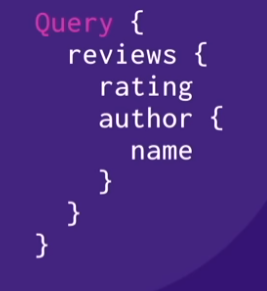
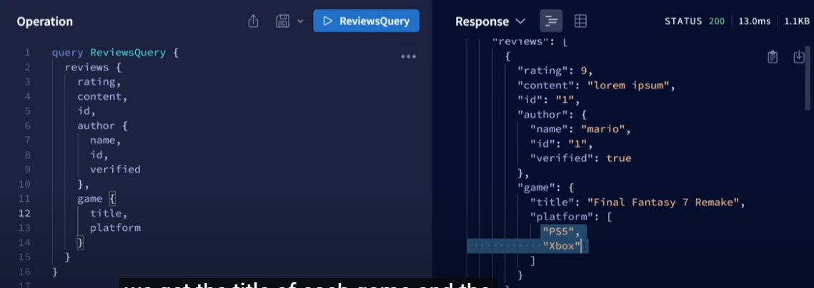
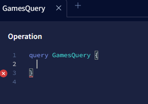
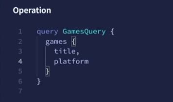

# GRAPHQL and APOLLO SERVER

Tal como dice su nombre, es un lenguaje de consultas.

En una API REST tradicional, tenemos los siguientes ENDPOINTS:

```
pokemonsite.com/api/pokemon
pokemonsite.com/api/pokemon/123
```
Estamos peticionando por una ID, lo que nos devuelve un POKEMOS diferente, segun la ID. A medida que nuestra aplicacion pueda llegar a crecer, los datos que requiera el usuario pueden ser mas complejos, en este caso podemos llegar a padecer un **OverFetching**, que es retornas mas datos de los que necesita el usuario.

Por ejemplo:

```
mysite.com/api/courses
```
Aqui nos estaria enviando toda la data disponible en la DB, que podrian ser cientos, o miles de "cursos", en este caso.

```
{
    "id": "1",
    "title": "Thud",
    "author": {...},
    "price": "10.99",
    "thumdnail_url": "...",
    "video_url": "...",
}
```
Quizás, solo necesitariamos la ID, el TITLE y el AUTHOR, y lo demás estaría sobrando en esta petición.

Por otro lado, podemos tener un **Under fetching**. Que es lo contrario, son menos datos de los que pediamos, o pocos datos que nos devuelve la petición.

```
mysite.com/api/courses/1
```
Nos devuelve lo siguiente:

```
{
    "id": "1",
    "title": "Thud",
    "author": {...},
    "price": "10.99",
    "thumdnail_url": "...",
    "video_url": "...",
}
```

Pero si queremos saber el AUTHOR, tenemos que hacer una peticion adicional:

```
mysite.com/api/author/1
```
Es en este punto donde se empiezan a complicar las peticiones, ya que si tenemos algunas anidadas, tendremos que hacer mas de una.

Gracias a GRAPHQL, esto puede simplificarce:

```
mygraphqlsite.com/graphql
```
Tenemos este simple ENDPOINT, y gracias la sintaxis de GQL podemos especificar que campos, o datos, vamos a peticionar al SERVIDOR:

```
Query {
    courses {
        id,
        title,
        thumbnail_url
    }
}
```
Solo le pedimos algunas propiedades especificas para nos las retorne. Tambien podemos pedir datos anidados con una consulta simple.

```
Query {
    courses(id: "1") {
        id,
        title,
        thumbnail_url,
        author {
            name,
            id,
            courses {
                id,
                title,
                thumbnail_url
            }
        }
    }
}
```

Todo esto manteniendo el ENDPOINT de GRAPHQL.

Lo que nos devuelve cada peticion con GQL, son GRAPHS (GRAFOS), que en esencia son tipos de datos (NODOS) conectados entre si:



Podemos conectar los recursos, es decir, si necesitamos el "nombre" del "autor" de una "review":




## APOLLO SANDBOX

Esta herramienta nos permite testear las peticiones con GRAPHQL:



Tomemos en consideración que algunos de los datos que tenemos en nuestra DB, estan anidados, en este caso, cuando pedimos el dato del **author**, nos exige que especifiquemos cuales necesitamos, ya que anida el **name**, el **id** y **verified**.

## Crando un proyecto con APOLLO SERVER GRAPHQL

Utilizando las sintaxis conocidas para inicializar un projecto de NODEJS, adicionalmente vamos establecer la funcionalidad de MODULES en nuestro package.json, eso lo podemos hacer con la terminal:
```
npm pkg set type="module"
```
Luego instalamos las dependencias de APOLLO SERVER y GRAPHQL.

```
npm install @apollo/server graphql
```

## SCHEMA, TYPEDEFS, RESOLVERS

Los **TypeDefs** son las definiciones de los diferentes tipos de datos que queremos exponer, es decir, los datos q necesitamos en la petición. 

El **Schema** es quien describe la forma del GRAPH y la data disponible en el.

En el caso de los **Resolvers**, es dond definimos como queremos manejar la data que enviamos, ya tenemos las definiciones en el **Schema**, ahora tenemos que crear las funciones en estos "resolvers". En este caso, no tenemos que preocuparnos por los campos que vamos a retornar, APOLLO SERVER hará ese trabajo por nosotros.


## APOLLO SANDBOX

En el **PlayGround** de Apollo podemos realizar todo tipo de pruebas con QUERYS.



Podemos usar un nombre aleatorio para la QUERY. 



En nuestra primera consulta con APOLLO SERVER, le pedimos esos campos y es todo lo q tenemos q hacer para que nos retorne la data que necesitamos.

## SINGULAR QUERY - QUERY VARIABLES

Hasta ahora solo retornamos una lista de datos, o sea, los enviamos todos juntos. Si solo queremos un registro en particular, en nuestro ejemplo, un solo "game" en particular. Por el momento esto no lo podemos hacer, para lograrlo tenemos que agregar mas ENTRYPOINT a nuestro GRAPH. 

```
type Query {
    reviews: [Review],
    review (id: ID!): Review,
}
```
En la QUERY vamos a admitir el Type ID, que no debe ser NULL, para poder encontrar la determinada **Review**. Luego de esto, tenemos que definir la función en los **resolvers**.

```
 review (_, args, context) { 
 return db.reviews.find((review) => review.id === args.id)
 }
```
El primer parametro es el PARENT, pero no lo necesitamos, asi que lo dejamos con el **underscore**, luego tenemos los argumento, y el contexto que por ahora no son requeridos.

Podemos hacer lo mismo con los demas TYPES si asi lo queremos.

# RELATED DATA

Podemos hacer relaciones entre los datos, pero primero lo tenemos que definir en el SCHEMA.

```
 type Game {
    id: ID!
    title: String!
    platform: [String!]!
    review: [Review!]! 
  }
```
En el caso del Type **Game**, vamos a necesitar que nos retorne la lista de REVIEWS, que no será un dato NULL.

Despues de esto, tenemos que definir la función en los resolvers. En este caso no deberiamos realizar en el OBJETO QUERY, porque ahi tenemos los ENTRYPOINT del GRAPH. Para eso definimos una nueva propiedad (que tambien será un objeto).

```
Game: {
reviews (parent) {
           return db.reviews.filter((r) => r.game_id === parent.id)
        }
}      
```
Tomamos el **parent**, que es la referencia al argumento PADRE, que es GAME en este caso, luego "filtramos" entre las "game_Id" y las id que tiene el Type PADRE para que nos retorne esos datos, que son las REVIEWS de un juego en específico.

Podemos seguir con los datos relacionados, por ejemplo, si queremos retornar los "autores" de esas REVIEWS.

**SANDBOX**
Al testar en el PLAYGROUND, podemos hacer una QUERY con los datos anidados que necesitamos:

```
query ReviewQuery($id: ID!){
  review(id: $id) {
    rating,
    game {
      title,
      platform
    },
    author {
      name,
      verified
    }
  }
}
```
Le pasamos una variable, por ejemplo la ID "1" de esa REVIEW:

```
{
  "id": "1"
}
```
Y nos retorna lo siguiente:

```
{
  "data": {
    "review": {
      "rating": 5,
      "game": {
        "title": "Zelda, Tears of the Kingdom",
        "platform": [
          "Switch"
        ]
      },
      "author": {
        "name": "mario",
        "verified": true
      }
    }
  }
}
```
A la QUERY de REVIEW, le pedimos el dato de "rating" (el propio), y las referencias del TYPE "Game", como el "title" y la "platform", y también las del "author", como el "name", "verified".

## MUTATIONS

Hasta el momento solo hemos solicitudes para obtener los datos que necesitamos. Por el lado de las **Mutations**, son esos cambios que le podemos hacer a los datos, ya sea, como: Añadir datos, borrarlos o editarlos.

```
type Mutation {
    deleteGame(id: ID!): [Game]
  }
```
En este caso, vamos a borrar un "Game", para eso necesitamos la ID de ese "Game" a borrar para después devolver la lista de los "Game" sin el que acabamos de eliminar. 

Una vez agregado al SCHEME, tenemos que crear la función en los **resolvers**:

```
   Mutation: {
        deleteGame (_, args) {
            db.games = db.games.filter((g) => g.id !== args.id) 

            return db.games
        }
    }
```
Solo se filtro la DB para que nos retorne la lista de "GAMES", quitando el "Game" con la ID que le pasamos por argumentos. Al reiniciar el servidor, podremos ver q estos cambios no se realizaron, para remover una elemento de alguna determinada DB, debemos utilizar la sintaxis SQL o NoSQL correspondiente.

### INPUTS

Para añadir un nuevo elemento, en nuestro ejemplo, un nuevo juego, no vamos a necesitar una ID en este caso. Solo el **INPUT** donde contendra el "title" y la "platform", lo tendremos así en nuestro SCHEMA:

```
type Mutation {
    addGame(game: AddGameInput!): Game
  }
  input AddGameInput {
    title: String!
    platform: [String!]!
  }
```

Una vez más, esto viene acompañado de una función en los **resolvers**:


